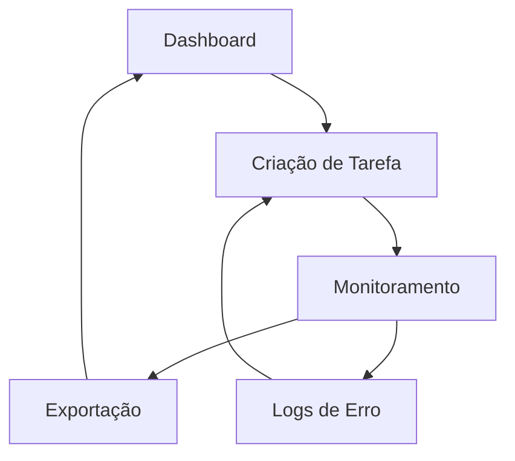

# Documento de Requisitos do Produto (PRD) - Aplicação de Web Scraping do Facebook

## 1. Visão Geral do Produto

Aplicação web desenvolvida em Python/Flask para extração automatizada de dados públicos do Facebook e exportação para planilhas Excel. A ferramenta visa automatizar tarefas manuais de coleta de dados, operando dentro dos termos de serviço do Facebook e leis de privacidade aplicáveis.

A aplicação resolve o problema de coleta manual e demorada de dados públicos do Facebook, sendo utilizada por analistas de dados, pesquisadores e profissionais de marketing que necessitam de informações estruturadas para análise posterior.

## 2. Funcionalidades Principais

### 2.1 Papéis de Usuário

| Papel | Método de Registro | Permissões Principais |
|-------|-------------------|----------------------|
| Usuário Padrão | Acesso direto à aplicação | Pode criar tarefas de scraping, visualizar progresso, exportar dados |

### 2.2 Módulo de Funcionalidades

Nossa aplicação de web scraping consiste nas seguintes páginas principais:

1. **Dashboard**: painel de controle principal, lista de tarefas, estatísticas de uso.
2. **Criação de Tarefa**: formulário de configuração, seleção de dados, configurações avançadas.
3. **Monitoramento**: visualização de progresso, logs de execução, status das tarefas.
4. **Exportação**: download de arquivos Excel, histórico de exportações.

### 2.3 Detalhes das Páginas

| Nome da Página | Nome do Módulo | Descrição da Funcionalidade |
|----------------|----------------|-----------------------------|
| Dashboard | Painel Principal | Exibir lista de tarefas ativas, estatísticas de uso, acesso rápido às funcionalidades principais |
| Dashboard | Lista de Tarefas | Visualizar todas as tarefas criadas com status, data de criação e ações disponíveis |
| Criação de Tarefa | Configuração Básica | Inserir URL do Facebook, nome da tarefa, descrição opcional com validação em tempo real |
| Criação de Tarefa | Seleção de Dados | Escolher tipos de dados para extração (posts, comentários, curtidas, informações de perfil) |
| Criação de Tarefa | Configurações Avançadas | Definir rate limiting, filtros de data, configurações de retry para usuários experientes |
| Monitoramento | Progresso em Tempo Real | Acompanhar execução das tarefas com barra de progresso e estimativa de tempo |
| Monitoramento | Logs de Execução | Visualizar logs detalhados, erros encontrados, estatísticas de extração |
| Exportação | Geração de Excel | Processar dados coletados e gerar arquivo Excel formatado com múltiplas planilhas |
| Exportação | Histórico de Downloads | Listar arquivos gerados anteriormente com opção de re-download |

## 3. Processo Central

O fluxo principal do usuário consiste em:

1. **Criação de Tarefa**: O usuário acessa o dashboard, clica em "Nova Tarefa" e é direcionado para o formulário de configuração em etapas
2. **Configuração**: Preenchimento da URL do Facebook, seleção dos tipos de dados desejados e configurações avançadas opcionais
3. **Execução**: Início da tarefa de scraping com monitoramento em tempo real do progresso
4. **Processamento**: Limpeza e estruturação automática dos dados extraídos
5. **Exportação**: Geração do arquivo Excel e disponibilização para download

## 4. Design da Interface do Usuário

### 4.1 Estilo de Design

- **Cores Primárias**: Azul (#1877F2 - cor do Facebook), Branco (#FFFFFF)
- **Cores Secundárias**: Cinza claro (#F5F5F5), Cinza escuro (#333333)
- **Estilo de Botões**: Arredondados com bordas suaves, efeito hover sutil
- **Fonte**: Inter ou system fonts, tamanhos 14px (corpo), 18px (títulos), 24px (cabeçalhos)
- **Layout**: Design baseado em cards, navegação superior fixa
- **Ícones**: Feather Icons ou similar, estilo minimalista

### 4.2 Visão Geral do Design das Páginas

| Nome da Página | Nome do Módulo | Elementos da UI |
|----------------|----------------|----------------|
| Dashboard | Painel Principal | Layout em grid 3x2, cards com bordas arredondadas, cores suaves, tipografia Inter 16px |
| Dashboard | Lista de Tarefas | Tabela responsiva, badges coloridos para status, botões de ação compactos |
| Criação de Tarefa | Formulário Multi-etapas | Stepper horizontal, campos com validação visual, botões primários azuis |
| Monitoramento | Barra de Progresso | Animação suave, cores verde/azul, percentual em tempo real |
| Exportação | Cards de Download | Ícones de arquivo, informações de tamanho, botões de download destacados |

### 4.3 Responsividade

A aplicação é desktop-first com adaptação mobile responsiva. Inclui otimização para interação touch em dispositivos móveis, com breakpoints em 768px (tablet) e 480px (mobile).