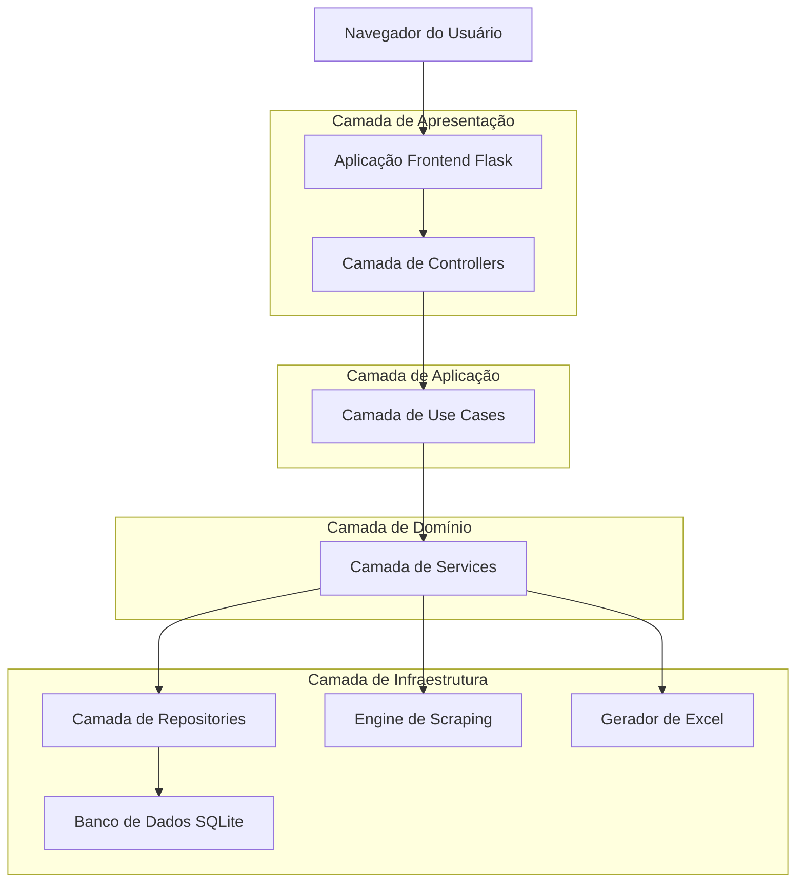
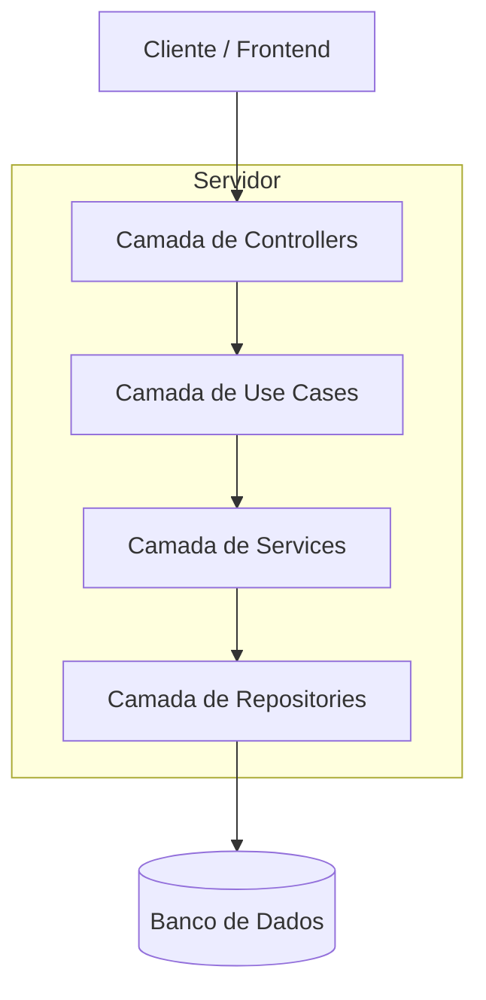
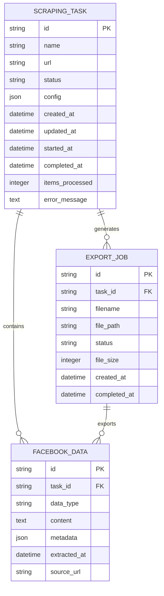

# Documento de Arquitetura Técnica - Aplicação de Web Scraping do Facebook

## 1. Design da Arquitetura



## 2. Descrição das Tecnologias

* **Frontend**: Flask\@2.3 + Jinja2 + Bootstrap\@5.3 + JavaScript ES6

* **Backend**: Python\@3.11 + Flask\@2.3 + SQLAlchemy\@2.0

* **Banco de Dados**: SQLite (desenvolvimento) / PostgreSQL (produção)

* **Scraping**: Selenium\@4.15 + BeautifulSoup\@4.12 + Requests\@2.31

* **Exportação**: openpyxl\@3.1 + pandas\@2.1

* **Testes**: pytest\@7.4 + pytest-flask\@1.3

## 3. Definições de Rotas

| Rota                    | Propósito                                                |
| ----------------------- | -------------------------------------------------------- |
| /                       | Dashboard principal, exibe tarefas ativas e estatísticas |
| /dashboard              | Página do dashboard com lista completa de tarefas        |
| /task/new               | Formulário de criação de nova tarefa de scraping         |
| /task/<id>              | Detalhes e monitoramento de tarefa específica            |
| /task/<id>/start        | Iniciar execução de tarefa de scraping                   |
| /task/<id>/stop         | Parar execução de tarefa em andamento                    |
| /export/<id>            | Página de exportação e download de dados                 |
| /api/task/<id>/progress | API para progresso em tempo real (JSON)                  |
| /api/task/<id>/logs     | API para logs de execução (JSON)                         |
| /download/<id>          | Download direto do arquivo Excel gerado                  |

## 4. Definições de API

### 4.1 APIs Principais

**Progresso da Tarefa**

```
GET /api/task/<id>/progress
```

Response:

| Nome do Parâmetro | Tipo do Parâmetro | Descrição                                          |
| ----------------- | ----------------- | -------------------------------------------------- |
| task\_id          | string            | Identificador único da tarefa                      |
| status            | string            | Status atual (pending, running, completed, failed) |
| progress          | integer           | Percentual de conclusão (0-100)                    |
| items\_processed  | integer           | Número de itens processados                        |
| estimated\_time   | integer           | Tempo estimado restante em segundos                |

Exemplo:

```json
{
  "task_id": "task_123",
  "status": "running",
  "progress": 65,
  "items_processed": 130,
  "estimated_time": 45
}
```

**Logs de Execução**

```
GET /api/task/<id>/logs
```

Response:

| Nome do Parâmetro | Tipo do Parâmetro | Descrição                           |
| ----------------- | ----------------- | ----------------------------------- |
| logs              | array             | Lista de entradas de log            |
| timestamp         | string            | Data/hora do log (ISO 8601)         |
| level             | string            | Nível do log (INFO, WARNING, ERROR) |
| message           | string            | Mensagem do log                     |

Exemplo:

```json
{
  "logs": [
    {
      "timestamp": "2024-01-15T10:30:00Z",
      "level": "INFO",
      "message": "Iniciando scraping da URL: https://facebook.com/page"
    },
    {
      "timestamp": "2024-01-15T10:30:15Z",
      "level": "WARNING",
      "message": "Rate limit detectado, aguardando 5 segundos"
    }
  ]
}
```

## 5. Arquitetura do Servidor



## 6. Modelo de Dados

### 6.1 Definição do Modelo de Dados



### 6.2 Linguagem de Definição de Dados

**Tabela de Tarefas de Scraping (scraping\_tasks)**

```sql
-- Criar tabela
CREATE TABLE scraping_tasks (
    id VARCHAR(36) PRIMARY KEY DEFAULT (lower(hex(randomblob(4))) || '-' || lower(hex(randomblob(2))) || '-4' || substr(lower(hex(randomblob(2))),2) || '-' || substr('89ab',abs(random()) % 4 + 1, 1) || substr(lower(hex(randomblob(2))),2) || '-' || lower(hex(randomblob(6)))),
    name VARCHAR(255) NOT NULL,
    url TEXT NOT NULL,
    status VARCHAR(20) DEFAULT 'pending' CHECK (status IN ('pending', 'running', 'completed', 'failed', 'cancelled')),
    config TEXT, -- JSON string
    created_at DATETIME DEFAULT CURRENT_TIMESTAMP,
    updated_at DATETIME DEFAULT CURRENT_TIMESTAMP,
    started_at DATETIME,
    completed_at DATETIME,
    items_processed INTEGER DEFAULT 0,
    error_message TEXT
);

-- Criar índices
CREATE INDEX idx_scraping_tasks_status ON scraping_tasks(status);
CREATE INDEX idx_scraping_tasks_created_at ON scraping_tasks(created_at DESC);
```

**Tabela de Dados do Facebook (facebook\_data)**

```sql
-- Criar tabela
CREATE TABLE facebook_data (
    id VARCHAR(36) PRIMARY KEY DEFAULT (lower(hex(randomblob(4))) || '-' || lower(hex(randomblob(2))) || '-4' || substr(lower(hex(randomblob(2))),2) || '-' || substr('89ab',abs(random()) % 4 + 1, 1) || substr(lower(hex(randomblob(2))),2) || '-' || lower(hex(randomblob(6)))),
    task_id VARCHAR(36) NOT NULL,
    data_type VARCHAR(50) NOT NULL CHECK (data_type IN ('post', 'comment', 'profile', 'like', 'share')),
    content TEXT,
    metadata TEXT, -- JSON string
    extracted_at DATETIME DEFAULT CURRENT_TIMESTAMP,
    source_url TEXT,
    FOREIGN KEY (task_id) REFERENCES scraping_tasks(id) ON DELETE CASCADE
);

-- Criar índices
CREATE INDEX idx_facebook_data_task_id ON facebook_data(task_id);
CREATE INDEX idx_facebook_data_type ON facebook_data(data_type);
CREATE INDEX idx_facebook_data_extracted_at ON facebook_data(extracted_at DESC);
```

**Tabela de Jobs de Exportação (export\_jobs)**

```sql
-- Criar tabela
CREATE TABLE export_jobs (
    id VARCHAR(36) PRIMARY KEY DEFAULT (lower(hex(randomblob(4))) || '-' || lower(hex(randomblob(2))) || '-4' || substr(lower(hex(randomblob(2))),2) || '-' || substr('89ab',abs(random()) % 4 + 1, 1) || substr(lower(hex(randomblob(2))),2) || '-' || lower(hex(randomblob(6)))),
    task_id VARCHAR(36) NOT NULL,
    filename VARCHAR(255) NOT NULL,
    file_path TEXT NOT NULL,
    status VARCHAR(20) DEFAULT 'pending' CHECK (status IN ('pending', 'processing', 'completed', 'failed')),
    file_size INTEGER,
    created_at DATETIME DEFAULT CURRENT_TIMESTAMP,
    completed_at DATETIME,
    FOREIGN KEY (task_id) REFERENCES scraping_tasks(id) ON DELETE CASCADE
);

-- Criar índices
CREATE INDEX idx_export_jobs_task_id ON export_jobs(task_id);
CREATE INDEX idx_export_jobs_status ON export_jobs(status);
CREATE INDEX idx_export_jobs_created_at ON export_jobs(created_at DESC);
```

**Dados Iniciais**

```sql
-- Inserir tarefa de exemplo para desenvolvimento
INSERT INTO scraping_tasks (name, url, status, config) VALUES 
('Exemplo - Página Pública', 'https://facebook.com/example-page', 'pending', '{"data_types": ["post", "comment"], "max_items": 100, "date_filter": null}');
```

